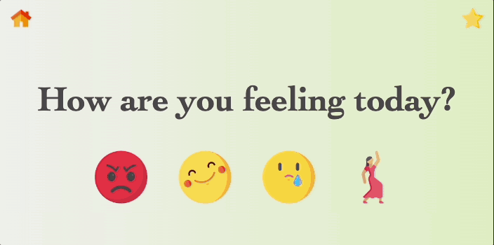

# test

[](https://opensource.org/licenses/MIT)

## Table of contents

- [Description](#description)
- [Installation](#installation)
- [Usage](#usage)
- [Tests](#tests)
- [Demo](#demo)
- [Built with](#built-with)
- [Roadmap](#roadmap)
- [Contributing](#contributing)
- [License](#license)
- [Authors](#authors)
- [GitHub](#github)
- [Email](#email)
- [Acknowledgements](#acknowledgements)

## Description
- test

## Installation

- Copy repository SSH key and clone the existing repository with the following command:

```
git clone <SSH key>
```

## Usage

- 

## Tests

- test includes a suite of automated tests to ensure that the application works as expected. To run the tests, use the following command:

```
npm run test
```

## Demo



## Built with

* html
* css
* js
* jquery
* 1
* 2
* 3

## Roadmap

- Currently, there are no directions for future development.

## Contributing

fe

## License

- test is released under:  

[](https://opensource.org/licenses/MIT)

## Authors

* ede
* de
* de 

## GitHub 

- [de](de)

## Email

- fe

de@live.com

## Acknowledgements

